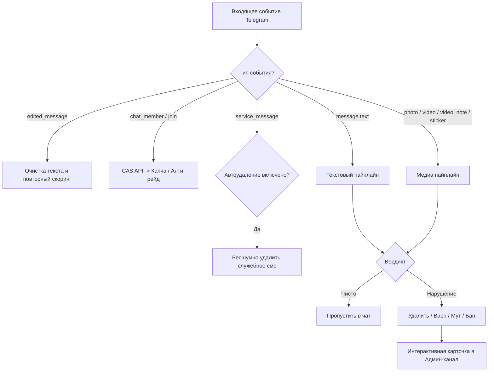
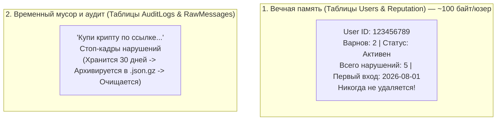

# 🛡 TelegramWarden — Интеллектуальный AI-Модератор и Защитник Чатов Telegram

> Полная архитектурная спецификация, схема работы модулей, структура репозитория и принятые технические решения.

---

## 📑 Содержание
1. [Главные принципы и философия проекта](#1-главные-принципы-и-философия-проекта)
2. [Общий пайплайн обработки сообщений](#2-общий-пайплайн-обработки-сообщений)
3. [Пайплайн проверки текста (Эвристика + LLM)](#3-пайплайн-проверки-текста)
4. [Пайплайн проверки медиа и видеокружочков (QR + NSFW + OCR + Keyframes)](#4-пайплайн-проверки-медиа-и-видеокружочков)
5. [Входной контроль и защита от ботов/рейдов](#5-входной-контроль-и-защита-от-ботоврейдов)
6. [Матрица нарушений и система наказаний](#6-матрица-нарушений-и-система-наказаний)
7. [Интерфейс администрирования и Mini App](#7-интерфейс-администрирования-и-mini-app)
8. [Двухуровневая база данных и политика очистки (Data Retention)](#8-двухуровневая-база-данных-и-политика-очистки)
9. [Полная файловая структура проекта](#9-полная-файловая-структура-проекта)
10. [Стек технологий и зависимости](#10-стек-технологий-и-зависимости)

---

## 1. Главные принципы и философия проекта

1. **Экономия бюджета (0 токенов на всё, что решается кодом):**
   - 90% трафика (чистые сообщения, проверка по CAS, анти-флуд, запрет инлайн-ботов, QR-коды, NSFW-детект на CPU) обрабатываются **бесплатно и локально на VPS**.
   - Платные токены LLM (DeepSeek / Groq) тратятся **только** на сложные, подозрительные тексты и завуалированный спам.
2. **Zero False-Positives (Никаких случайных банов нормальных людей):**
   - Градация уверенности ИИ ($>85\%$ — автодействие, $50-85\%$ — мягкий алерт админам).
   - Никаких банов за ссылки в Bio профиля.
   - Возможность админам в 1 клик нажать кнопку `[Ложное срабатывание]` для отмены наказания и самообучения промпта.
3. **100% модульность и гибкость для админа:**
   - Каждая функция имеет тумблер `ВКЛ / ВЫКЛ`.
   - Поддержка переопределения правил для отдельных топиков (Forum Topics).
4. **Защита от обхода логики (Anti-Bypass):**
   - Перехват `edited_message` (защита от редактирования сообщений на спам).
   - Очистка скрытых спецсимволов (Zero-Width, гомоглифы, RTL-символы).
   - Защита от спама через чужие каналы (`sender_chat`).

---

## 2. Общий пайплайн обработки сообщений



---

## 3. Пайплайн проверки текста

1. **Нормализатор текста:**
   - Удаление Zero-Width символов (`\u200B`, `\uFEFF` и др.).
   - Приведение визуально идентичных букв (латиница $\leftrightarrow$ кириллица) к единому алфавиту.
   - Извлечение скрытых ссылок из Markdown/HTML разметки.
2. **Риск-скоринг (0 мс, 0 токенов):**
   - Бытовые фразы («Привет», «Спасибо», стикеры) от участников со стажем пропускаются мгновенно без запросов к LLM.
   - Триггеры для вызова LLM: сообщения со ссылками, юзернеймами, пересылками из каналов, вбросы от новичков ($< 3$ дней), а также фоновый 5% сэмплинг.
3. **DeepSeek / Groq Intent Engine:**
   - Системный промпт для выявления намерений (крипто-скам, реклама, фишинг, токсичность, призывы в ЛС).
   - Формат ответа строго структурированный JSON:
     ```json
     {
       "is_violation": true,
       "category": "scam",
       "confidence": 94,
       "reason": "Завуалированное предложение крипто-инвестиций с переводом в ЛС",
       "suggested_action": "delete_and_warn"
     }
     ```
   - Мульти-провайдер: DeepSeek V3/Flash как основной, авто-фоллбэк на Groq/OpenAI при таймаутах.

---

## 4. Пайплайн проверки медиа и видеокружочков

Все шаги выполняются **локально на CPU за 30–70 мс (0 токенов)** с использованием `onnxruntime`, `pyav`, `pyzbar` и `paddleocr`:

```mermaid
flowchart TD
    A[Медиа: Картинка / Видео / Кружочек / Стикер] --> B[1. Дедупликатор pHash\nКэш подтвержденного спама (1 мс)]
    B -- Хэш совпал со спам-базой --> BAN[Удаление + Бан/Варн]
    B -- Новый файл --> C{Тип медиа?}
    
    C -- Видео / Кружочек --> V_SPLIT[Извлечение 5 ключевых кадров\n0%, 25%, 50%, 75%, 95% таймлайна]
    C -- Фото / Стикер --> IMG_FRAME[Кадр в память io.BytesIO]

    V_SPLIT --> CHECK_LOOP[Проверка кадров: QR + NudeNet + OCR]
    IMG_FRAME --> CHECK_LOOP

    CHECK_LOOP -- Обнаружено нарушение --> SAVE_EVIDENCE[Сохранить стоп-кадр как улику для админа] --> BAN
    CHECK_LOOP -- Все кадры чистые --> DISCARD[Мгновенно освободить память] --> PASS[Пропустить в чат]
```

### Детали реализации медиа-контроля:
1. **Проверка видео и кружочков для ВСЕХ пользователей (новые и старые):**
   - Защита от "спрятанного порно в середине ролика": извлекаются 4–5 кадров (0%, 25%, 50%, 75%, 95%).
   - Если в **любом** кадре найдена запрещенная анатомия (`EXPOSED_GENITALIA`, `EXPOSED_BREAST`, `ANUS`) — мгновенный бан и удаление.
2. **Управление памятью:**
   - Если кадры чистые — память очищается моментально (`io.BytesIO`).
   - Если найдено нарушение — стоп-кадр с нарушением временно прикрепляется к карточке в канале админов для доказательства и аудита.
3. **QR-коды и баннеры:**
   - Мгновенный скан QR-кодов (`pyzbar`) и извлечение текста с картинок (`PaddleOCR-lite` / `Tesseract`) без платных Vision API.
4. **Визуальный хэш (pHash):**
   - 8-байтный отпечаток в Redis. В черный список хэшей вносится **только подтвержденный спам**. Обычные мемы повторно отправляются свободно.

---

## 5. Входной контроль и защита от ботов/рейдов

1. **CAS (Combot Anti-Spam API):**
   - Мгновенная проверка ID нового участника по бесплатной глобальной базе при входе.
   - Если пользователь в черном списке — моментальный превентивный бан.
2. **Модульная капча (на выбор админа):**
   - **Режим 1 (Кнопка + Таймер):** Ограничение прав на запись, кнопка «Я человек», авто-кик через $N$ минут при отсутствии ответа.
   - **Режим 2 (AI-профайлинг):** Анализ подозрительности имени/юзернейма.
3. **Anti-Raid (Режим осады):**
   - Детекция волны входов ($>10$ участников за 15 секунд).
   - Автоматический перевод чата в режим тишины или заявок на вступление с алертом админам.

---

## 6. Матрица нарушений и система наказаний

| Категория | Тяжесть | Действие по умолчанию | Настраиваемость |
| :--- | :--- | :--- | :--- |
| **Порнография / NSFW / Gore** | 🔴 Критическая | Удаление + Бан / Варн + удаление смс за 24ч | Админ может сменить на варн |
| **Крипто-скам / Фишинг** | 🔴 Критическая | Мгновенный Бан + удаление всех смс за 24ч | Полная |
| **Реклама / Ссылки / Спам** | 🟡 Средняя | Удаление сообщения + Предупреждение (Варн 1/3) | Лимит варнов настраивается |
| **Флуд / Повторы сообщений** | 🟡 Средняя | Удаление + Временный Мут (10–30 мин) | Лимиты частоты настраиваются |
| **Токсичность / Трэш** | 🟢 Мягкая | Предупреждение в чате / Удаление | Чувствительность слайдером |

- **Сгорание варнов:** Автоматическое сгорание через 14 дней без новых нарушений.

---

## 7. Интерфейс администрирования и Mini App

1. **Интерактивные логи в закрытом Админ-канале:**
   - Карточка с деталями нарушения: User ID, юзернейм, причина, вердикт ИИ, процент уверенности, цитата/стоп-кадр нарушения.
   - Кнопки быстрого действия: `[Разбанить]`, `[Снять варн]`, `[Забанить наглухо]`, `[Ложное срабатывание]`.
2. **Инлайн-меню в ЛС бота (`/settings`):**
   - Быстрые переключатели функций на ходу.
3. **Telegram Mini App (WebUI Dashboard):**
   - Статистика пойманных ботов и спама за 24ч / 7д / 30д.
   - Слайдеры чувствительности ИИ (пороги Confidence).
   - Управление белыми списками (White List ботов, пользователей, каналов).
   - Настройка «Тихого часа» (ночного режима) и правил для отдельных топиков.

---

## 8. Двухуровневая база данных и политика очистки

Разделение данных на **постоянную репутационную память** и **временный журнал аудита**:



- **СУБД:** PostgreSQL 16 (асинхронный драйвер `asyncpg` + SQLAlchemy 2.0).
- **Кэш & Очереди:** Redis 7 (кэширование настроек, pHash спама, сессий капчи, рейт-лимитов).
- **Фоновый клинер (Data Retention):**
  - Кэш сообщений для контекста: удаляется через 24 часа.
  - Сырые тексты удаленных сообщений: архивируются и очищаются через 30 дней (остаются только обезличенные счетчики статистики).
  - Истекшие варны: сгорают по расписанию через 14 дней.

---

## 9. Полная файловая структура проекта

```
TelegramWarden/
├── .env.example                  # Образец переменных окружения (токены, ключи API, порты)
├── .gitignore                    # Исключения Git (кэши, модели, логи, .env)
├── docker-compose.yml            # Сервисы: Bot+API, PostgreSQL, Redis
├── Dockerfile                    # Сборка Python-приложения
├── requirements.txt              # Зависимости Python
├── PROJECT_BLUEPRINT.md          # Этот файл архитектурной спецификации
│
├── alembic/                      # Миграции базы данных
│   ├── env.py
│   └── versions/
│
├── core/                         # Ядро конфигурации и общие утилиты
│   ├── config.py                 # Загрузка и валидация .env (Pydantic Settings)
│   ├── database.py               # Async SQLAlchemy сессии и engine
│   ├── redis_client.py           # Асинхронный клиент Redis
│   └── logger.py                 # Структурированное логирование (Loguru)
│
├── models/                       # SQLAlchemy модели базы данных
│   ├── chat.py                   # Настройки чатов и топиков
│   ├── user.py                   # Пользователи, репутация, дата входа (Вечное хранение)
│   ├── warn.py                   # История предупреждений (варнов)
│   └── log.py                    # Журнал аудита модерации (30-дневная ротация)
│
├── services/                     # Движки анализа и внешние интеграции
│   ├── ai/                       # LLM-модуль
│   │   ├── client.py             # OpenAI / DeepSeek / Groq клиент с фоллбэком
│   │   ├── prompts.py            # Оптимизированные системные Few-Shot промпты
│   │   └── schema.py             # Pydantic-схемы для строгого JSON-парсинга
│   ├── media/                    # Локальный анализ медиа на CPU (0 токенов)
│   │   ├── video_sampler.py      # Извлечение 5 ключевых кадров из видео/кружков (pyav)
│   │   ├── qr_detector.py        # Декодер QR-кодов и ссылок (pyzbar)
│   │   ├── nsfw_detector.py      # ONNX NudeNet v3 локальный инференс
│   │   ├── ocr_engine.py         # PaddleOCR / Tesseract скан текста на фото
│   │   └── phash.py              # Perceptual hash дедупликатор
│   ├── reputation/               # Проверки репутации
│   │   └── cas.py                # Клиент Combot Anti-Spam (CAS API)
│   └── cleaner/                  # Фоновая очистка и архивация
│       └── retention.py          # Удаление старых логов, архивация в .gz, сгорание варнов
│
├── bot/                          # Telegram Bot на базе Aiogram 3.x
│   ├── main.py                   # Точка входа бота
│   ├── middlewares/              # Мидлвари
│   │   ├── rate_limit.py         # Защита от флуда
│   │   ├── text_sanitizer.py     # Нормализатор текста (Zero-Width, homoglyphs)
│   │   └── db_session.py         # Внедрение сессии БД в хэндлеры
│   ├── handlers/                 # Обработчики событий
│   │   ├── text_messages.py      # Обработка текстовых сообщений
│   │   ├── media_messages.py     # Обработка фото, видео, стикеров, кружков
│   │   ├── edited_messages.py    # Перехват и проверка редактирований
│   │   ├── joins.py              # Вход участников, капча, анти-рейд
│   │   ├── service_cleanup.py    # Удаление служебных сообщений (joins/leaves)
│   │   └── admin_actions.py      # Обработка кнопок в админ-логах (разбан, варн)
│   ├── keyboards/                # Инлайн-клавиатуры
│   │   ├── captcha.py            # Кнопки прохождения капчи
│   │   └── admin_logs.py         # Кнопки под карточками нарушений
│   └── utils/                    # Вспомогательные функции
│       └── sanctions.py          # Применение банов, мутов, удаления смс
│
├── api/                          # FastAPI бэкенд для Telegram Mini App
│   ├── main.py                   # Точка входа FastAPI
│   ├── routes/                   # API маршруты
│   │   ├── auth.py               # Валидация Telegram WebApp initData
│   │   ├── chats.py              # Чтение и обновление настроек чатов
│   │   └── stats.py              # Статистика и аналитика нарушений
│   └── schemas/                  # Pydantic схемы API
│
└── webapp/                       # Telegram Mini App Frontend (SPA)
    ├── index.html
    ├── package.json
    ├── vite.config.ts
    └── src/
        ├── App.tsx
        ├── pages/                # Страницы: Дашборд, Настройки, Логи
        └── components/           # UI компоненты (тумблеры, карточки, слайдеры)
```

---

## 10. Стек технологий и зависимости

- **Core Backend:** Python 3.12, `aiogram >= 3.10`, `fastapi >= 0.111`, `uvicorn`, `pydantic >= 2.7`
- **Database & Cache:** `PostgreSQL 16`, `SQLAlchemy >= 2.0`, `asyncpg`, `alembic`, `redis-py`
- **AI & LLM Client:** `openai >= 1.30` (совместим с DeepSeek API, Groq, OpenRouter)
- **Local Media Engines:** `onnxruntime`, `pyav`, `pillow`, `numpy`, `imagehash`, `pyzbar`
- **Frontend Mini App:** `React 18`, `TypeScript`, `Tailwind CSS`, `Vite`, `@telegram-apps/sdk`
