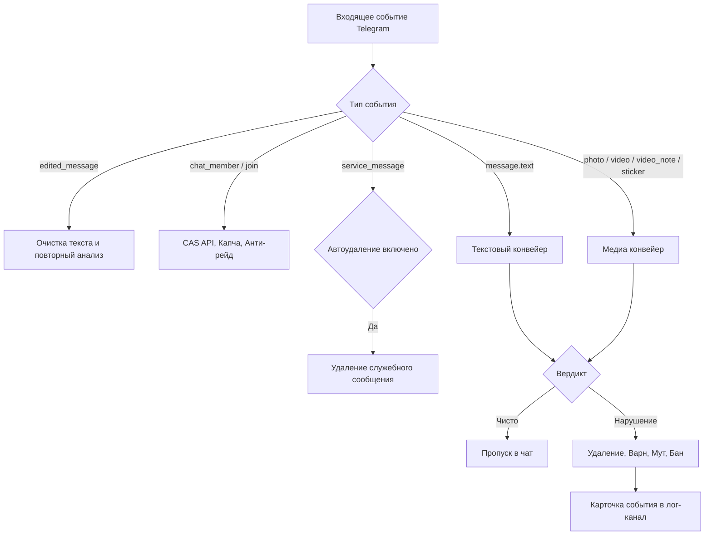
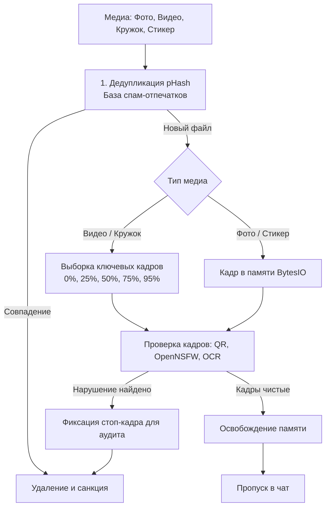

# TelegramWarden: архитектурная спецификация и план проекта

Техническое описание архитектуры, схемы модулей, структуры репозитория и проектных решений системы защиты Telegram-сообществ TelegramWarden.

---

## Содержание

1. [Принципы проектирования](#1-принципы-проектирования)
2. [Общий конвейер обработки сообщений](#2-общий-конвейер-обработки-сообщений)
3. [Конвейер анализа текста](#3-конвейер-анализа-текста)
4. [Конвейер анализа медиафайлов](#4-конвейер-анализа-медиафайлов)
5. [Входной контроль и защита от рейдов](#5-входной-контроль-и-защита-от-рейдов)
6. [Категории нарушений и система санкций](#6-категории-нарушений-и-система-санкций)
7. [Панель управления и Mini App](#7-панель-управления-и-mini-app)
8. [Хранение данных и регламент очистки](#8-хранение-данных-и-регламент-очистки)
9. [Файловая структура репозитория](#9-файловая-структура-репозитория)
10. [Стек технологий и зависимости](#10-стек-технологий-и-зависимости)

---

## 1. Принципы проектирования

1. Экономия вычислительных ресурсов:
   - Основная масса рядовых сообщений, проверка CAS, антифлуд, ограничения ботов, QR-коды и NSFW-детекция обрабатываются локально на CPU без расхода платных токенов.
   - Запросы к LLM (DeepSeek, Groq) отправляются только при наличии признаков подозрительности, ссылок или при плановом сэмплировании.
2. Минимизация ложных срабатываний:
   - Градация уверенности классификатора (порог автоматического действия и порог отправки на ручную проверку).
   - Интерактивная кнопка отмены наказания администратором для исправления ошибочных вердиктов.
3. Модульность и независимость настроек:
   - Отдельное включение и выключение каждого фильтра для каждого чата.
   - Поддержка индивидуальных правил для форумных топиков.
4. Устойчивость к обходу фильтров:
   - Повторный анализ отредактированных сообщений.
   - Очистка скрытых спецсимволов (Zero-Width, обфусцированные омоглифы, RTL).
   - Контроль сообщений, отправленных от имени сторонних каналов.

---

## 2. Общий конвейер обработки сообщений



---

## 3. Конвейер анализа текста

1. Нормализация текста:
   - Удаление Zero-Width символов и невидимых меток.
   - Транслитерация графически схожих символов различных алфавитов к каноническому виду.
   - Извлечение скрытых гиперссылок из разметки Markdown и HTML.
2. Эвристический риск-скоринг:
   - Обычные реплики постоянных участников пропускаются без обращения к внешним нейросетям.
   - Факторы для передачи на анализ LLM: ссылки, юзернеймы, пересылки, сообщения от недавних участников (менее 3 дней в чате), сэмплинг трафика.
3. Tier-1 triage (TypeSafe Jev, опционально, `JEV_ENABLED`):
    - Быстрая классификация без генерации текста: `noul` (вероятность нарушения) + `choice` по 9 категориям.
    - Чистые (`prob < JEV_FAST_PASS_THRESHOLD`, по умолчанию 0.03) пропускаются без LLM; метрики каждого triage — в `logs/jev_triage.jsonl` для калибровки порога.
    - Подозрительные уходят в LLM с хинтом категории; `illegal_contraband`/`phishing` с ненулевой массой и сообщения со скрытыми ссылками эскалируются всегда.
    - Любой сбой Jev (таймаут, 429/529, сеть) — прозрачный fallback на LLM; неверный ключ отключает tier через circuit breaker.
4. Модуль классификации намерений (DeepSeek / Groq):
   - Промпт для распознавания категорий нарушений (скам, реклама, фишинг, агрессия).
   - Строгая валидация ответа через JSON-схему:
     ```json
     {
       "is_violation": true,
       "category": "scam",
       "confidence": 94,
       "reason": "Завуалированное предложение инвестиций с переводом в ЛС",
       "suggested_action": "delete_and_warn"
     }
     ```
   - Отказоустойчивое переключение на резервный API при сбоях или таймаутах.

---

## 4. Конвейер анализа медиафайлов

Проверка выполняется локально на CPU с помощью onnxruntime, pyav, pyzbar и tesseract:



### Особенности обработки медиа:
1. Выборка ключевых кадров для видеозаписей и видеосообщений для выявления вредоносных вставок в середине файла.
2. Распознавание QR-кодов и ссылок на изображениях.
3. Детекция недопустимого контента локальной моделью Yahoo Open-NSFW.
4. Ведение перцептивных хэшей (pHash) для мгновенной фильтрации повторных спам-рассылок.

---

## 5. Входной контроль и защита от рейдов

1. Проверка по базе Combot Anti-Spam (CAS API):
   - Запрос к базе при входе нового пользователя.
   - Превентивная блокировка при наличии подтвержденного профиля спамера.
2. Модуль капчи:
   - Ограничение прав на отправку сообщений до прохождения проверки.
   - Кнопочная капча с таймером и автоматическим удалением сервисных сообщений.
3. Защита от спам-атак (Anti-Raid):
   - Фиксация резкого роста числа входов (более 8 участников за 15 секунд).
   - Временная блокировка или перевод чата в режим заявок.

---

## 6. Категории нарушений и система санкций

| Категория | Уровень риска | Действие по умолчанию | Настройка |
| :--- | :--- | :--- | :--- |
| Порнография и NSFW | Высокий | Удаление и бан | Настраивается |
| Крипто-скам и фишинг | Высокий | Удаление и мгновенный бан | Настраивается |
| Реклама и спам-ссылки | Средний | Удаление и предупреждение | Настраивается |
| Флуд и повторы текста | Средний | Удаление и ограничение сообщений | Настраивается |
| Оскорбления и агрессия | Низкий | Предупреждение или удаление | Настраивается |

Предупреждения автоматически аннулируются по истечении установленного срока (по умолчанию 14 дней).

---

## 7. Панель управления и Mini App

1. Журнал модерации в закрытом канале:
   - Карточка инцидента: ID пользователя, категория, процент уверенности, фрагмент сообщения.
   - Кнопки управления: разбан, снятие варна, блокировка, отметка ложного срабатывания.
2. Меню настроек в боте:
   - Быстрое переключение базовых опций через команду `/settings`.
3. Панель Telegram Mini App:
   - Статистика инцидентов и действий модерации.
   - Регулировка порогов чувствительности.
   - Управление списками исключений (пользователи, боты, каналы).
   - Настройка тихого часа и правил для отдельных топиков.

---

## 8. Хранение данных и регламент очистки

1. Долгосрочное хранение:
   - Профили пользователей, репутационные метрики и счетчики нарушений (таблица users).
2. Временные данные:
   - Журнал аудита (таблица audit_logs) и кэш сообщений.
3. Регламентные задачи:
   - Кэш контекста сообщений очищается через 24 часа.
   - Детализированные записи аудита архивируются и ротируются через 30 дней.
   - Истекшие предупреждения деактивируются по расписанию.

---

## 9. Файловая структура репозитория

```
TelegramWarden/
├── .env.example                  # Шаблон переменных окружения
├── docker-compose.yml            # Конфигурация контейнеров
├── Dockerfile                    # Сборка приложения
├── requirements.txt              # Зависимости Python
├── PROJECT_BLUEPRINT.md          # Данный документ спецификации
│
├── core/                         # Ядро и системные модули
│   ├── config.py                 # Валидация конфигурации
│   ├── database.py               # Сессии и движок SQLAlchemy
│   ├── redis_client.py           # Клиент Redis
│   └── logger.py                 # Логирование
│
├── models/                       # Модели базы данных
│   ├── chat.py                   # Настройки чатов
│   ├── user.py                   # Пользователи и репутация
│   ├── warn.py                   # Предупреждения
│   └── audit_log.py              # Журнал аудита
│
├── services/                     # Сервисные модули
│   ├── ai/                       # Модули LLM и нормализации
│   ├── media/                    # Обработка медиа, OCR, QR, NSFW
│   ├── gatekeeper/               # Капча, CAS, анти-рейд
│   └── cleaner/                  # Ротация и очистка данных
│
├── bot/                          # Telegram-бот (aiogram 3)
│   ├── handlers/                 # Обработчики команд и сообщений
│   ├── keyboards/                # Клавиатуры и разметка
│   ├── middlewares/              # Промежуточные обработчики
│   └── utils/                    # Вспомогательные утилиты
│
├── api/                          # FastAPI бэкенд
│   ├── routes/                   # Маршруты API
│   ├── auth.py                   # Аутентификация initData
│   └── schemas.py                # Схемы данных
│
└── webapp/                       # Telegram Mini App
    ├── bundle.js                 # Скомпилированный интерфейс
    ├── index.html                # Базовый HTML
    └── vendor/                   # Локальные библиотеки
```

---

## 10. Стек технологий и зависимости

- Ядро: Python 3.12, aiogram 3, FastAPI, uvicorn, Pydantic v2
- Базы данных: PostgreSQL 16 (SQLAlchemy 2.0 Async, asyncpg), Redis 7
- ИИ и классификация: DeepSeek API, Groq API (Llama 3.3)
- Компьютерное зрение и медиа: onnxruntime, pyav, pillow, numpy, imagehash, pyzbar, tesseract
- Интерфейс: React 18, Tailwind CSS, Telegram WebApp SDK
