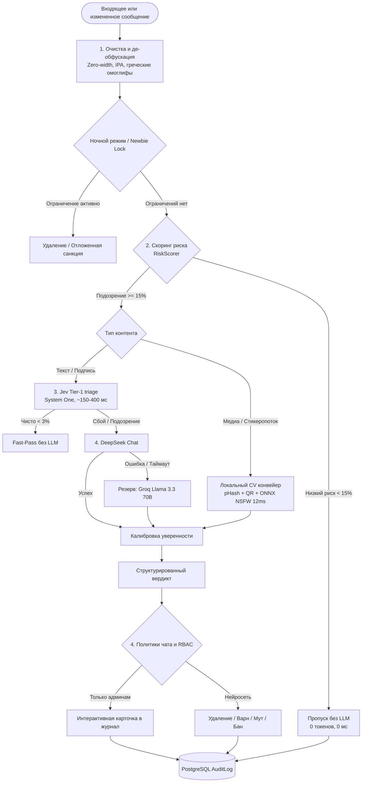

# TelegramWarden 

Интеллектуальная система защиты, модерации и администрирования Telegram-сообществ на базе гибридного анализа LLM (DeepSeek, Groq Llama), локальных ONNX нейросетей компьютерного зрения (Yahoo Open-NSFW) и полнофункциональной Telegram Mini App панели управления.

> ВНИМАНИЕ: Проект активно развивается и обновляется до стабильной версии v1.1.0-stable. Основной функционал полностью реализован, архитектурно укреплен и покрыт набором из 86 автоматизированных тестов. Если вы найдете ошибку, у вас есть предложения по улучшению или вопросы по сотрудничеству — пишите мне в личные сообщения.

---

## Мои контакты и канал

- Моя личка в Telegram: https://t.me/ivanchikbyte
- Мой Telegram-канал: https://t.me/ivanchik_byte

---

## Содержание

1. [Ключевые возможности](#ключевые-возможности)
2. [Скриншоты интерфейса](#скриншоты-интерфейса)
3. [Технологический стек](#технологический-стек)
4. [Архитектура и схема работы](#архитектура-и-схема-работы)
5. [Требования к окружению](#требования-к-окружению)
6. [Установка и запуск (Linux и Windows)](#установка-и-запуск-linux-и-windows)
7. [Подключение и бесплатный Cloudflare Tunnel](#подключение-и-бесплатный-cloudflare-tunnel)
8. [Инструкция для ИИ-агентов](#инструкция-для-ии-агентов)
9. [Переменные окружения (.env)](#переменные-окружения-env)
10. [Команды бота и администрирование](#команды-бота-и-администрирование)
11. [Тестирование и контроль качества](#тестирование-и-контроль-качества)
12. [Развертывание в Production](#развертывание-в-production)
13. [Лицензия и контакты](#лицензия-и-контакты)

---

## Ключевые возможности

- **Многоуровневый анализ текста (0 токенов для чистых сообщений)**:
  - Автоматическая очистка невидимых символов, Zero-Width пробелов, Zalgo и мягких переносов.
  - Таблица транслитерации скрытых омоглифов и обфусцированных алфавитов (IPA Small Capitals, Komi Cyrillic, греческие символы).
  - Де-обфускация и сопоставление спам-ключей по оригинальному и нормализованному тексту с защитой от ложных срабатываний на границах слов.
  - Эвристический скоринг риска на базе репутации пользователя. Сообщения проверенных участников пропускаются мгновенно без расхода токенов.

- **Гибридный LLM-движок классификации нарушений**:
  - Первичный анализ через DeepSeek (OpenAI-совместимый API).
  - Резервное отказоустойчивое переключение на Groq (Llama 3.3 70B) при сетевых задержках или сбоях.
  - Калибровка уверенности модели: сглаживание экстремальных значений (1%/99%), нормализация шкал 0-1 и 0-100, честная обработка неопределенных вердиктов без ложных банов.
  - Единое ядро модерации для новых и отредактированных сообщений с предотвращением повторного применения санкций.

- **Локальный конвейер проверки медиафайлов (Без внешних платных Vision API)**:
  - Детекция взрослого контента и порнографии через локальную ONNX модель Yahoo Open-NSFW (инференс на CPU за ~12 мс).
  - Проверка анимированных изображений, GIF, видео-кружочков и видеостикеров. TGS стикеры отправляются на модерацию без слепого пропуска.
  - Ограничение отправки медиафайлов для новичков чата (Newbie Media Lock).
  - Декодирование QR-кодов на баннерах и стикерах для выявления скрытых фишинговых ссылок.
  - Распознавание текста на картинках через локальный OCR движок.
  - Перцептивный хеш (pHash) с извлечением ключевых кадров видео для мгновенной дедупликации повторяющихся медиа-атак (1 мс).

- **Защита от рейдов и наплыва спам-ботов (Gatekeeper)**:
  - Интерактивная капча при входе в группу с таймером автоудаления и кика зависших ботов.
  - Автоматический локдаун чата при превышении порога входов (>8 пользователей за 15 секунд).
  - Проверка по глобальной базе спамеров Combot Anti-Spam (CAS API).

- **Ночной режим (Тихий час)**:
  - Настраиваемый интервал тишины с учетом часового пояса чата (например, 23:00 - 08:00 MSK).
  - Отложенное применение санкций и утренний дайджест нарушений для администраторов.

- **Интерактивная панель управления (Telegram Mini App)**:
  - Автономный интерфейс без внешних CDN-зависимостей, моментальная загрузка за ~20 мс.
  - Строгая криптографическая аутентификация по HMAC-SHA256 initData с защитой от Replay-атак по таймстампу (auth_date).
  - Настройка чувствительности нейросетей, порогов уверенности и персональных действий для каждой категории (Авто, Не трогать, Удалить, Варн, Мут, Бан).
  - Выбор режима обработки жалоб (/report): отправка карточки админам или мгновенный вердикт ИИ.
  - Журнал аудита с возможностью отметки ложных срабатываний (False Positive) только авторизованными администраторами чата.
  - Встроенный PostgreSQL Data Explorer для супер-администраторов с валидными схемами моделей.

---

## Скриншоты интерфейса

Я спроектировал темную адаптивную веб-панель управления (Telegram Mini App), которая открывается прямо внутри Telegram:

| Главная панель (Обзор) | Настройки модерации (Фильтры) | Журнал аудита (Логи) |
| :---: | :---: | :---: |
|  |  |  |

---

## Технологический стек

- **Язык разработки**: Python 3.12+
- **Фреймворк Telegram-бота**: aiogram 3.18+ (асинхронный роутинг, middleware, FSM)
- **REST API бэкенд**: FastAPI 0.115+ (Pydantic v2, CORS, HMAC WebApp Auth)
- **База данных**: PostgreSQL 16 (SQLAlchemy 2.0 Async, asyncpg)
- **Кэш и очереди**: Redis 7 (aioredis, скользящие окна rate-limiting, атомарные сессии)
- **Локальный Machine Learning / CV**: ONNX Runtime (CPU), Pillow, NumPy, ImageHash, PyZbar
- **LLM Провайдеры**: DeepSeek API (primary), Groq API (fallback Llama 3.3 70B)
- **Фронтенд панели**: React 18, Tailwind CSS, Telegram WebApp SDK
- **Контейнеризация**: Docker, Docker Compose

---

## Архитектура и схема работы

Подробное описание архитектуры, схемы потоков данных, структуры базы данных и конвейеров модерации доступно в отдельном документе:
[docs/ARCHITECTURE.md](docs/ARCHITECTURE.md)

### Схема обработки данных



---

## Требования к окружению

Для локального запуска или развертывания на сервере вам понадобятся:
- **Linux** (Ubuntu 22.04+ / Debian 12+) или **Windows 10/11** (PowerShell / WSL2)
- Docker Desktop (для Windows) или Docker Engine + Docker Compose (для Linux)
- Либо Python 3.12+, PostgreSQL 16+, Redis 7+
- Токен Telegram-бота (от @BotFather)
- API-ключ DeepSeek или Groq API
- (Опционально) API-ключ TypeSafe Jev (`TYPESAFE_API_KEY`) для Tier-1 triage; без него бот работает как раньше, напрямую через DeepSeek

---

## Установка и запуск (Linux и Windows)

### Метод 1. Запуск через Docker Compose (Рекомендуется для всех ОС)

#### На Linux / macOS:
```bash
# 1. Клонируйте мой репозиторий
git clone https://github.com/ivanchik-byte/TelegramWarden.git
cd TelegramWarden

# 2. Создайте файл конфигурации
cp .env.example .env

# 3. Отредактируйте .env (укажите BOT_TOKEN, SUPERADMIN_IDS, DEEPSEEK_API_KEY)
nano .env

# 4. Запустите весь стек
docker compose up -d --build

# 5. Проверьте статус
docker compose ps
docker compose logs -f warden_app
```

#### На Windows (PowerShell):
```powershell
# 1. Клонируйте мой репозиторий
git clone https://github.com/ivanchik-byte/TelegramWarden.git
cd TelegramWarden

# 2. Создайте файл конфигурации
Copy-Item .env.example .env

# 3. Откройте и заполните .env
notepad .env

# 4. Запустите сервисы
docker compose up -d --build

# 5. Проверьте статус
docker compose ps
docker compose logs -f warden_app
```

---

### Метод 2. Локальный запуск без Docker (Python Virtualenv)

#### На Linux / macOS:
```bash
# 1. Создайте и активируйте venv
python3.12 -m venv .venv
source .venv/bin/activate

# 2. Установите зависимости
pip install --upgrade pip
pip install -r requirements.txt

# 3. Подготовьте .env
cp .env.example .env

# 4. Запустите базы данных (Postgres + Redis)
docker compose up -d postgres redis

# 5. Запустите бота и бэкенд
python -m bot.main
```

#### На Windows (PowerShell):
```powershell
# 1. Создайте и активируйте venv
python -m venv .venv
Set-ExecutionPolicy -ExecutionPolicy RemoteSigned -Scope CurrentUser
.\.venv\Scripts\Activate.ps1

# 2. Установите зависимости
python -m pip install --upgrade pip
pip install -r requirements.txt

# 3. Подготовьте .env
Copy-Item .env.example .env

# 4. Запустите базы данных в Docker
docker compose up -d postgres redis

# 5. Запустите бота и бэкенд
python -m bot.main
```

---

## Подключение и бесплатный Cloudflare Tunnel

1. **Telegram-бот**: Работает в режиме Long Polling через библиотеку `aiogram 3`. Ему не нужны открытые порты или белый IP — бот сам подключается к серверам Telegram по защищенному протоколу.
2. **Веб-панель (Mini App)**: Требует HTTPS. Для этого в проект встроена поддержка бесплатного Cloudflare Tunnel:
   - **Быстрый временный туннель (Без регистрации)**:
     ```bash
     cloudflared tunnel --url http://127.0.0.1:2009
     ```
   - **Постоянный туннель в Docker**: Добавьте токен туннеля в `.env` (`CLOUDFLARE_TUNNEL_TOKEN`) и запустите:
     ```bash
     docker compose --profile tunnel up -d
     ```

---

## Инструкция для ИИ-агентов

Для автоматических агентов разработки и автономных скриптов развертывания подготовлена отдельная компактная инструкция:
[INSTALL.md](INSTALL.md)

---

## Переменные окружения (.env)

| Переменная | Обязательная | Описание | Пример значения |
| :--- | :---: | :--- | :--- |
| `BOT_TOKEN` | Да | Токен Telegram-бота от @BotFather | `123456789:ABCdefGHIjklMNO` |
| `SUPERADMIN_IDS` | Да | Telegram ID главных администраторов (через запятую) | `8667615215,12345678` |
| `DEEPSEEK_API_KEY`| Да | API ключ DeepSeek для основного анализа | `sk-xxxxxxxxxxxxxxxx` |
| `DEEPSEEK_BASE_URL`| Нет | Базовый URL DeepSeek API | `https://api.deepseek.com` |
| `FALLBACK_AI_ENABLED`| Нет | Включение резервного LLM провайдера | `true` |
| `FALLBACK_API_KEY`| Нет | API ключ Groq для резервного анализа Llama 3.3 | `gsk_xxxxxxxxxxxxxxxxx` |
| `JEV_ENABLED`| Нет | Tier-1 triage через TypeSafe Jev (без ключа не включается) | `false` |
| `TYPESAFE_API_KEY`| Нет | API ключ TypeSafe для Jev triage | `ts-xxxxxxxxxxxxxxxx` |
| `JEV_MODEL`| Нет | Зафиксированная версия модели (пороги калибруются под версию) | `jev-1.13.0` |
| `JEV_FAST_PASS_THRESHOLD`| Нет | Порог fast-pass чистых (консервативно до калибровки) | `0.03` |
| `WEBAPP_URL` | Да | Публичный HTTPS URL панели управления | `https://your-domain.com/app` |
| `CLOUDFLARE_TUNNEL_TOKEN`| Нет | Токен постоянного бесплатного Cloudflare Tunnel | `eyJhIjoi...` |
| `POSTGRES_USER` | Да | Пользователь базы данных PostgreSQL | `warden_user` |
| `POSTGRES_PASSWORD`| Да | Пароль базы данных PostgreSQL | `warden_secure_password` |
| `POSTGRES_DB` | Да | Имя базы данных | `warden_db` |
| `DATABASE_URL` | Да | URL подключения к PostgreSQL | `postgresql+asyncpg://...` |
| `REDIS_URL` | Да | URL подключения к Redis | `redis://localhost:6379/0` |
| `API_PORT` | Нет | Порт FastAPI сервера | `2009` |
| `CAS_API_ENABLED` | Нет | Включение проверки спам-базы CAS | `true` |

---

## Команды бота и администрирование

### Команды для всех участников группы
- `/start` - Открыть главное меню, интерактивный профиль и справку.
- `/profile` или `/me` - Просмотр своей репутации, количества сообщений и активных предупреждений.
- `/rules` - Просмотр действующих правил группы.
- `/report` (в ответ на сообщение) - Отправить жалобу модераторам или ИИ на спам/нарушение.

### Команды для администраторов группы
- `/warn [причина]` (в ответ на сообщение) - Выдать официальное предупреждение пользователю.
- `/unwarn` (в ответ на сообщение) - Снять последнее активное предупреждение.
- `/clearwarns` (в ответ на сообщение) - Полностью аннулировать все варны пользователя.
- `/mute [время] [причина]` (в ответ на сообщение) - Ограничить отправку сообщений (примеры: `/mute 30m спам`, `/mute 2h`, `/mute 1d`).
- `/unmute` (в ответ на сообщение) - Снять ограничение на отправку сообщений.
- `/ban [причина]` (в ответ на сообщение) - Навсегда заблокировать и исключить нарушителя.
- `/settings` - Открыть веб-панель управления параметрами группы.

---

## Тестирование и контроль качества

Я покрыл весь проект полным набором автоматизированных асинхронных unit- и интеграционных тестов с использованием `pytest`:

```bash
# Запуск полного набора тестов (86 тестов)
pytest tests/ -v
```

Тестовый набор включает:
- Проверку де-обфускации текста, омоглифов и скрытых ссылок (`test_text_sanitizer.py`).
- Логику эвристического риск-анализатора и сопоставления ключевых слов (`test_risk_scorer.py`).
- Калибровку уверенности LLM и отказоустойчивое переключение (`test_ai_client.py`).
- Интеграцию с локальным NSFW-детектором и медиа-конвейером (`test_media_pipeline.py`).
- Защиту от повторных Replay-атак и криптографическую валидацию Telegram HMAC (`test_api.py`).
- Контроль доступа к базе данных и метаданным (`test_database_api.py`).
- Логику временных окон ночного режима и таймзон (`test_night_mode.py`).
- Роутинг админских команд и системы варнов (`test_user_and_mod_commands.py`, `test_sanctions.py`).

---

## Развертывание в Production

1. Настройте доменное имя и SSL-сертификат (например, через Nginx или Cloudflare Tunnel) для проксирования на локальный порт `2009`.
2. Укажите полученный HTTPS-адрес в переменной `WEBAPP_URL` в `.env`.
3. Запустите контейнеры в фоновом режиме:
```bash
docker compose up -d
```
4. Настройте регулярное резервное копирование тома PostgreSQL (`warden_postgres_data`).

---

## Лицензия и мои контакты

Проект распространяется под свободной лицензией MIT. Подробнее см. в файле [LICENSE](LICENSE).

Автор проекта: **ivanchikbyte**
- Моя личка в Telegram: https://t.me/ivanchikbyte
- Мой Telegram-канал: https://t.me/ivanchik_byte
