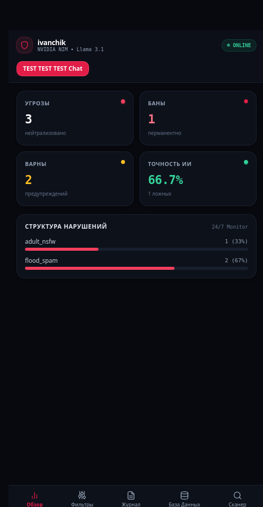
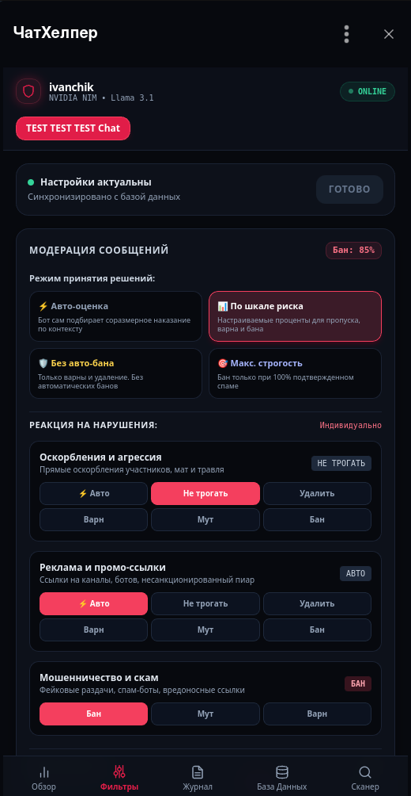
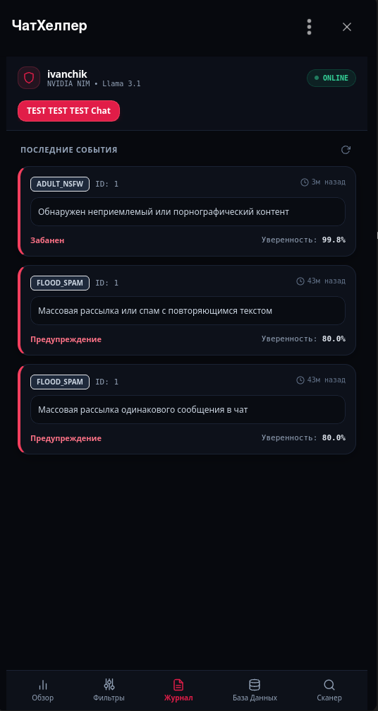

# TelegramWarden

Система защиты и администрирования Telegram-сообществ с многоуровневым конвейером: пре-фильтрация без расхода токенов, скоростной Tier-1 триаж TypeSafe Jev (System One, рекомендуется для продакшена), локальные ONNX-модели компьютерного зрения (Yahoo Open-NSFW), классификация через LLM (DeepSeek / Groq) и встроенная панель управления Telegram Mini App.

> Статус: версия v1.1.1-stable. Кодовая база покрыта набором из 109 автоматизированных тестов. Вопросы по развертыванию или найденным багам можно отправлять в личные сообщения или открывать в issues.

---

## Контакты

- Личные сообщения в Telegram: https://t.me/ivanchikbyte
- Канал проекта: https://t.me/ivanchik_byte

---

## Содержание

1. [Возможности](#возможности)
2. [Интерфейс панели управления](#интерфейс-панели-управления)
3. [Технологический стек](#технологический-стек)
4. [Архитектура и схема работы](#архитектура-и-схема-работы)
5. [Требования к окружению](#требования-к-окружению)
6. [Установка и запуск (Linux и Windows)](#установка-и-запуск-linux-и-windows)
7. [Подключение и бесплатный Cloudflare Tunnel](#подключение-и-бесплатный-cloudflare-tunnel)
8. [Инструкция для агентов](#инструкция-для-агентов)
9. [Переменные окружения (.env)](#переменные-окружения-env)
10. [Команды бота](#команды-бота)
11. [Тестирование](#тестирование)
12. [Развертывание в продакшене](#развертывание-в-продакшене)
13. [Лицензия](#лицензия)

---

## Возможности

- **Скоростной триаж Tier-1 через TypeSafe Jev (Рекомендуется для продакшена)**:
  - Специализированная дискриминативная модель System One для мгновенной классификации текста без накладных расходов на генерацию чат-токенов.
  - Сокращение задержки ответа: время проверки снижается с 2.5-4 секунд до 150-400 мс.
  - Экономия расходов: отсекает до 80-90% обращений к дорогим генеративным LLM за счет безопасного пропуска чистых реплик (Fast-Pass при вероятности нарушения ниже 3%).
  - Архитектура Defense-Only: Jev используется только для быстрого пропуска проверенного трафика; любые карательные санкции (варн, мут, бан) требуют подтверждения от большой LLM с развернутым объяснением причины.
  - Отказоустойчивый fallback: при задержке ответа Jev, лимитах или временных сбоях сети запрос прозрачно направляется в DeepSeek или Groq без прерывания модерации.

- **Анализ текста без лишних вызовов API**:
  - Очистка невидимых символов, zero-width пробелов, Zalgo и мягких переносов.
  - Таблица транслитерации скрытых омоглифов и нестандартных алфавитов (IPA Small Capitals, Komi Cyrillic, греческие символы).
  - Де-обфускация и сопоставление спам-ключей по оригинальному и нормализованному тексту с проверкой границ слов.
  - Скоринг риска по репутации пользователя в чате: сообщения постоянных участников пропускаются сразу, экономя вычислительные ресурсы.

- **Классификация нарушений через LLM**:
  - Основной контур через DeepSeek (OpenAI-совместимый API).
  - Резервное переключение на Groq (Llama 3.3 70B) при задержках или сбоях сети.
  - Калибровка уверенности: сглаживание экстремумов (1%/99%), нормализация шкал и защита от ложных банов при неуверенности модели.
  - Единое ядро модерации для новых и отредактированных сообщений с защитой от повторных санкций.

- **Локальная проверка медиафайлов (без внешних платных Vision API)**:
  - Детекция взрослого контента через локальную ONNX модель Yahoo Open-NSFW (инференс на CPU занимает около 12 мс).
  - Проверка анимированных изображений, GIF, видеосообщений и видеостикеров.
  - Ограничение отправки медиафайлов для новых участников (Newbie Media Lock).
  - Декодирование QR-кодов на картинках и стикерах для выявления фишинговых ссылок.
  - Распознавание текста на изображениях через Tesseract OCR.
  - Перцептивный хеш (pHash) с ключевыми кадрами видео для мгновенного отсечения повторного спама (1 мс).

- **Защита от рейдов и ботов (Gatekeeper)**:
  - Интерактивная капча при входе с таймером автоудаления и исключением зависших ботов.
  - Локдаун чата при всплеске входов (более 8 пользователей за 15 секунд).
  - Проверка по глобальной базе спамеров Combot Anti-Spam (CAS API).

- **Ночной режим (Тихий час)**:
  - Настройка интервала тишины с учетом часового пояса группы (например, 23:00 - 08:00 MSK).
  - Отложенное применение санкций и утренний отчет для администраторов.

- **Панель управления (Telegram Mini App)**:
  - Автономный интерфейс без внешних CDN-зависимостей, моментальная загрузка.
  - Аутентификация по HMAC-SHA256 initData с проверкой давности таймстампа (auth_date).
  - Настройка чувствительности фильтров, порогов уверенности и действий по каждой категории (автоматически, игнорировать, удалить, варн, мут, бан).
  - Выбор режима обработки жалоб (/report): карточка администраторам или вердикт модели.
  - Журнал аудита с подтверждением ложных срабатываний только авторизованными администраторами.
  - Встроенный просмотрщик данных PostgreSQL для главных администраторов.

---

## Интерфейс панели управления

Панель открывается прямо внутри Telegram через WebApp:

| Главная панель (Обзор) | Настройки модерации (Фильтры) | Журнал аудита (Логи) |
| :---: | :---: | :---: |
|  |  |  |

---

## Технологический стек

- **Язык разработки**: Python 3.12+
- **Фреймворк Telegram-бота**: aiogram 3.18+ (асинхронный роутинг, middleware, FSM)
- **REST API бэкенд**: FastAPI 0.115+ (Pydantic v2, CORS, HMAC WebApp Auth)
- **База данных**: PostgreSQL 16 (SQLAlchemy 2.0 Async, asyncpg)
- **Кэш и очереди**: Redis 7 (aioredis, скользящие окна rate-limiting, атомарные сессии)
- **Локальный Machine Learning / CV**: ONNX Runtime (CPU), Pillow, NumPy, ImageHash, PyZbar
- **Нейросетевой триаж и LLM**:
  - TypeSafe Jev (Tier-1 триаж System One, рекомендуется для продакшена: задержка 150-400 мс, экономия 80-90% токенов)
  - DeepSeek API (основная модель классификации и формирования обоснований на русском языке)
  - Groq API (резервный провайдер Llama 3.3 70B при таймаутах или сбоях сети)
- **Фронтенд панели**: React 18, Tailwind CSS, Telegram WebApp SDK
- **Контейнеризация**: Docker, Docker Compose

---

## Архитектура и схема работы

Подробное описание архитектуры, схемы потоков данных, структуры базы данных и конвейеров модерации доступно в отдельном документе:
[docs/ARCHITECTURE.md](docs/ARCHITECTURE.md)

### Схема обработки данных

```mermaid
flowchart TD
    UserMsg([Входящее или измененное сообщение]) --> PrePass[1. Очистка и де-обфускация\nZero-width, IPA, греческие омоглифы]
    PrePass --> GateCheck{Ночной режим / Newbie Lock}
    
    GateCheck -->|Ограничение активно| DeferSanction[Удаление / Отложенная санкция]
    GateCheck -->|Ограничений нет| RiskEngine{2. Скоринг риска\nRiskScorer}
    
    RiskEngine -->|Низкий риск < 15%| FastPass[Пропуск без LLM\n0 токенов, 0 мс]
    
    RiskEngine -->|Подозрение >= 15%| MediaOrText{Тип контента}
    
    MediaOrText -->|Медиа / Стикеропоток| CVFilter[Локальный CV конвейер\npHash + QR + ONNX NSFW 12ms]
    MediaOrText -->|Текст / Подпись| JevTriage[3. Jev Tier-1 triage (Рекомендуется)\nSystem One, ~150-400 мс]

    JevTriage -->|Чисто < 3%| JevPass[Fast-Pass без вызова LLM]
    JevTriage -->|Сбой / Подозрение| LLMPrimary[4. DeepSeek Chat]

    LLMPrimary -->|Ошибка / Таймаут| LLMFallback[Резерв: Groq Llama 3.3 70B]
    LLMPrimary -->|Успех| VerdictCalibrator[Калибровка уверенности]
    LLMFallback --> VerdictCalibrator
    CVFilter --> VerdictCalibrator
    
    VerdictCalibrator --> Verdict[Структурированный вердикт]
    Verdict --> PolicyRouter{4. Политики чата и RBAC}
    PolicyRouter -->|Только админам| AdminCard[Интерактивная карточка в журнал]
    PolicyRouter -->|Нейросеть| AutoSanction[Удаление / Варн / Мут / Бан]
    
    AdminCard --> AuditDB[(PostgreSQL AuditLog)]
    AutoSanction --> AuditDB
    FastPass --> AuditDB
```

---

## Требования к окружению

Для локального запуска или развертывания на сервере вам понадобятся:
- **Linux** (Ubuntu 22.04+ / Debian 12+) или **Windows 10/11** (PowerShell / WSL2)
- Docker Desktop (для Windows) или Docker Engine + Docker Compose (для Linux)
- Либо Python 3.12+, PostgreSQL 16+, Redis 7+
- Токен Telegram-бота (от @BotFather)
- API-ключ DeepSeek или Groq API
- API-ключ TypeSafe Jev (`TYPESAFE_API_KEY`): **настоятельно рекомендуется для продакшена**. Обеспечивает мгновенный триаж за 150-400 мс и снижает расходы на вызовы LLM до 10 раз. При отсутствии ключа бот автоматически переходит в режим прямой классификации через DeepSeek.

---

## Установка и запуск (Linux и Windows)

### Метод 1. Запуск через Docker Compose (Рекомендуется для всех ОС)

#### На Linux / macOS:
```bash
# 1. Клонируйте мой репозиторий
git clone https://github.com/ivanchik-byte/TelegramWarden.git
cd TelegramWarden

# 2. Создайте файл конфигурации
cp .env.example .env

# 3. Отредактируйте .env (укажите BOT_TOKEN, SUPERADMIN_IDS, DEEPSEEK_API_KEY)
nano .env

# 4. Запустите весь стек
docker compose up -d --build

# 5. Проверьте статус
docker compose ps
docker compose logs -f warden_app
```

#### На Windows (PowerShell):
```powershell
# 1. Клонируйте мой репозиторий
git clone https://github.com/ivanchik-byte/TelegramWarden.git
cd TelegramWarden

# 2. Создайте файл конфигурации
Copy-Item .env.example .env

# 3. Откройте и заполните .env
notepad .env

# 4. Запустите сервисы
docker compose up -d --build

# 5. Проверьте статус
docker compose ps
docker compose logs -f warden_app
```

---

### Метод 2. Локальный запуск без Docker (Python Virtualenv)

#### На Linux / macOS:
```bash
# 1. Создайте и активируйте venv
python3.12 -m venv .venv
source .venv/bin/activate

# 2. Установите зависимости
pip install --upgrade pip
pip install -r requirements.txt

# 3. Подготовьте .env
cp .env.example .env

# 4. Запустите базы данных (Postgres + Redis)
docker compose up -d postgres redis

# 5. Запустите бота и бэкенд
python -m bot.main
```

#### На Windows (PowerShell):
```powershell
# 1. Создайте и активируйте venv
python -m venv .venv
Set-ExecutionPolicy -ExecutionPolicy RemoteSigned -Scope CurrentUser
.\.venv\Scripts\Activate.ps1

# 2. Установите зависимости
python -m pip install --upgrade pip
pip install -r requirements.txt

# 3. Подготовьте .env
Copy-Item .env.example .env

# 4. Запустите базы данных в Docker
docker compose up -d postgres redis

# 5. Запустите бота и бэкенд
python -m bot.main
```

---

## Подключение и бесплатный Cloudflare Tunnel

1. **Telegram-бот**: Работает в режиме Long Polling через aiogram 3. Открытые порты и белый IP не требуются, бот сам держит соединение с серверами Telegram.
2. **Панель управления (Mini App)**: Требует HTTPS. Для локальной разработки или стендов без домена доступен Cloudflare Tunnel:
   - Временный туннель:
     ```bash
     cloudflared tunnel --url http://127.0.0.1:2009
     ```
   - Постоянный туннель в Docker: укажите токен туннеля в `.env` (`CLOUDFLARE_TUNNEL_TOKEN`) и запустите:
     ```bash
     docker compose --profile tunnel up -d
     ```

---

## Инструкция для агентов

Инструкция по развертыванию и проверке окружения собрана в файле [INSTALL.md](INSTALL.md).

---

## Переменные окружения (.env)

| Переменная | Обязательная | Описание | Пример значения |
| :--- | :---: | :--- | :--- |
| `BOT_TOKEN` | Да | Токен Telegram-бота от @BotFather | `123456789:ABCdefGHIjklMNO` |
| `SUPERADMIN_IDS` | Да | Telegram ID главных администраторов через запятую | `8667615215,12345678` |
| `DEEPSEEK_API_KEY`| Да | API ключ DeepSeek для основного анализа | `sk-xxxxxxxxxxxxxxxx` |
| `DEEPSEEK_BASE_URL`| Нет | Базовый URL DeepSeek API | `https://api.deepseek.com` |
| `FALLBACK_AI_ENABLED`| Нет | Включение резервного LLM провайдера | `true` |
| `FALLBACK_API_KEY`| Нет | API ключ Groq для резервного анализа Llama 3.3 | `gsk_xxxxxxxxxxxxxxxxx` |
| `JEV_ENABLED`| Нет | Включение Tier-1 триажа через TypeSafe Jev (рекомендуется true) | `true` |
| `TYPESAFE_API_KEY`| Нет | API ключ TypeSafe для скоростного триажа (рекомендуется для продакшена) | `ts-xxxxxxxxxxxxxxxx` |
| `JEV_MODEL`| Нет | Зафиксированная версия модели под калиброванные пороги | `jev-1.13.0` |
| `JEV_FAST_PASS_THRESHOLD`| Нет | Порог fast-pass для безопасного пропуска чистых сообщений | `0.03` |
| `WEBAPP_URL` | Да | Публичный HTTPS URL панели управления | `https://your-domain.com/app` |
| `CLOUDFLARE_TUNNEL_TOKEN`| Нет | Токен постоянного Cloudflare Tunnel | `eyJhIjoi...` |
| `POSTGRES_USER` | Да | Пользователь базы данных PostgreSQL | `warden_user` |
| `POSTGRES_PASSWORD`| Да | Пароль базы данных PostgreSQL | `warden_secure_password` |
| `POSTGRES_DB` | Да | Имя базы данных | `warden_db` |
| `DATABASE_URL` | Да | URL подключения к PostgreSQL | `postgresql+asyncpg://...` |
| `REDIS_URL` | Да | URL подключения к Redis | `redis://localhost:6379/0` |
| `API_PORT` | Нет | Порт FastAPI сервера | `2009` |
| `CAS_API_ENABLED` | Нет | Проверка спам-базы CAS | `true` |

---

## Команды бота

### Команды для участников
- `/start`: главное меню, профиль и справка
- `/profile` или `/me`: просмотр своей репутации, числа сообщений и варнов
- `/rules`: правила группы
- `/report` (в ответ на сообщение): отправка жалобы модераторам на спам или нарушение

### Команды для администраторов
- `/warn [причина]` (в ответ на сообщение): выдать предупреждение
- `/unwarn` (в ответ на сообщение): снять последнее активное предупреждение
- `/clearwarns` (в ответ на сообщение): аннулировать все предупреждения пользователя
- `/mute [время] [причина]` (в ответ): ограничить отправку сообщений (например: `/mute 30m спам`, `/mute 2h`, `/mute 1d`)
- `/unmute` (в ответ на сообщение): снять ограничение на отправку сообщений
- `/ban [причина]` (в ответ на сообщение): заблокировать и исключить нарушителя
- `/settings`: открыть веб-панель управления группой

---

## Тестирование

Кодовая база покрыта набором асинхронных unit- и интеграционных тестов на `pytest`:

```bash
# Запуск полного набора тестов (109 тестов)
pytest tests/ -v
```

Тесты проверяют:
- Де-обфускацию текста, омоглифы и скрытые ссылки (`test_text_sanitizer.py`).
- Эвристический риск-анализатор и сопоставление спам-паттернов (`test_risk_scorer.py`).
- Калибровку уверенности LLM и каскадное переключение провайдеров (`test_ai_client.py`).
- Скоростной Tier-1 триаж TypeSafe Jev и логирование метрик (`test_jev_triage.py`).
- Локальный NSFW-детектор и медиа-конвейер (`test_media_pipeline.py`).
- Защиту от повторных replay-атак и HMAC-валидацию Telegram initData (`test_api.py`).
- Контроль доступа к базе данных и метаданным (`test_database_api.py`).
- Временные окна ночного режима и таймзоны (`test_night_mode.py`).
- Обработку админских команд и систему варнов (`test_user_and_mod_commands.py`, `test_sanctions.py`).

---

## Развертывание в продакшене

1. Настройте доменное имя и SSL-сертификат (через Nginx или Cloudflare Tunnel) с проксированием на порт `2009`.
2. Укажите полученный HTTPS-адрес в переменной `WEBAPP_URL` в `.env`.
3. **Рекомендация для активных сообществ**: включите TypeSafe Jev (`JEV_ENABLED=true`, `TYPESAFE_API_KEY=...`). Это снижает затраты на генеративные токены DeepSeek на 80-90% и обеспечивает мгновенный отклик модератора (150-400 мс) даже при интенсивных дискуссиях.
4. Запустите контейнеры:
```bash
docker compose up -d
```
5. Настройте регулярный бэкап тома PostgreSQL (`warden_postgres_data`).

---

## Лицензия и контакты

Проект распространяется под лицензией MIT. Подробнее: [LICENSE](LICENSE).

Автор: **ivanchikbyte**
- Личные сообщения в Telegram: https://t.me/ivanchikbyte
- Канал проекта: https://t.me/ivanchik_byte

